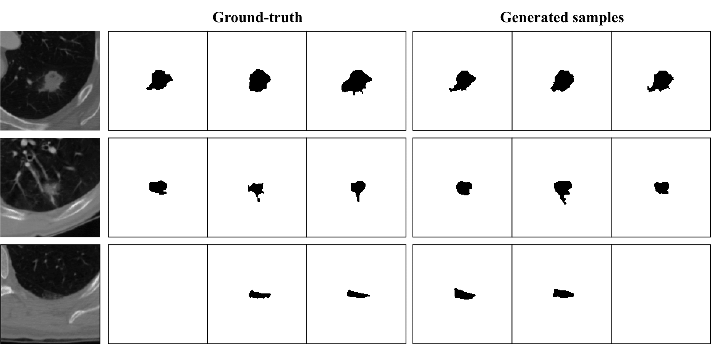

# Stochastic Segmentation with Conditional Categorical Diffusion Models

The official code repo for the paper [Stochastic Segmentation with Conditional Categorical Diffusion Models](https://arxiv.org/abs/2303.08888).

### Abstract: 
Semantic segmentation has made significant progress in recent years thanks to deep neural networks, but the common objective of generating a single segmentation output that accurately matches the image's content may not be suitable for safety-critical domains such as medical diagnostics and autonomous driving. Instead, multiple possible correct segmentation maps may be required to reflect the true distribution of annotation maps. In this context, stochastic semantic segmentation methods must learn to predict conditional distributions of labels given the image, but this is challenging due to the typically multimodal distributions, high-dimensional output spaces, and limited annotation data. To address these challenges, we propose a conditional categorical diffusion model (CCDM) for semantic segmentation based on Denoising Diffusion Probabilistic Models. Our model is conditioned to the input image, enabling it to generate multiple segmentation label maps that account for the aleatoric uncertainty arising from divergent ground truth annotations. Our experimental results show that CCDM achieves state-of-the-art performance on LIDC, a stochastic semantic segmentation dataset, and outperforms established baselines on the classical segmentation dataset Cityscapes.




## Installation
Requires Python 3.10 and Torch 1.7.0 (see `requirements.txt`):
```
pip install -r requirements.txt
```

## Datasets
### LIDC
For LIDCv1: We used the data available on [Stefan Knegt's gihub page](https://github.com/stefanknegt/Probabilistic-Unet-Pytorch).

For LIDCv2:  This split of LIDC can be found on the github page of [Hierarchical Probabilistic U-Net](https://github.com/deepmind/deepmind-research/tree/master/hierarchical_probabilistic_unet) or from this [Google Drive link](https://drive.google.com/drive/folders/13KWz8GS5Agrg8vg-N2CLa_ltEWGRWvWd).

### Cityscapes
Download from here: [Cityscapes dataset](https://www.cityscapes-dataset.com/).

## Training
### Segmentation with multiple annotations
For training on LIDCv1, copy the dataset to `${TMPDIR}/data_lidc.hdf5`, and, in `params.yml`, set:
```
dataset_file: datasets.lidc
```

### Segmentation with a single annotations
For training on Cityscapes, copy the dataset to `${TMPDIR}/cityscapes/`, and, in `params.yml`, set:
```
dataset_file: datasets.cityscapes
```

To run the training:
```
python ddpm_train.py params.yml
```

## Evaluation
For evalution on LIDC, in `params_eval.yml`, set:
```
dataset_file: datasets.lidc
```
For evalution on Cityscapes, in `params_eval.yml`, set:
```
dataset_file: datasets.cityscapes
```
To run the evaluation:
```
python ddpm_eval.py params_eval.yml
```

## Citation
If you find our work relevant to your research, please cite:
```
@article{zbinden2023stochastic,
  title={Stochastic Segmentation with Conditional Categorical Diffusion Models},
  author={Zbinden, Lukas and Doorenbos, Lars and Pissas, Theodoros and Sznitman, Raphael and M{\'a}rquez-Neila, Pablo},
  journal={arXiv preprint arXiv:2303.08888},
  year={2023}
}
```

## License
The code is published under the [MIT License](LICENSE).

## Updates
- 15/03/2023 Initial commit.
